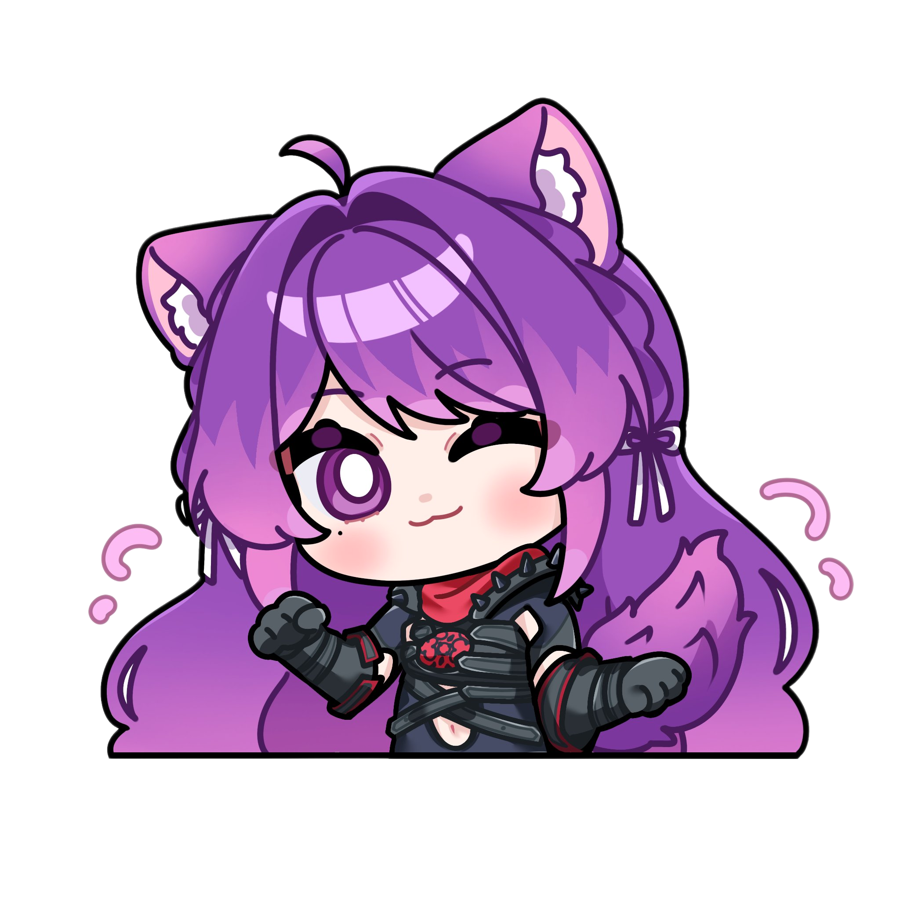

# Marvel Rivals Tools

A comprehensive desktop application for Marvel Rivals players featuring team randomization, bingo game, and coaching rubric tools.



## 🎮 Features

### **Hero Team Randomizer**
- Randomly generate balanced team compositions
- Support for all 42 Marvel heroes
- Smart role distribution (Tank, DPS, Support)
- One-click team generation with sound effects

### **Rivals Bingo**
- Interactive 5x5 bingo grid with Marvel Rivals-specific phrases
- Custom phrase input support
- Click-to-mark functionality with visual feedback
- Animated background and smooth UI transitions

### **Coaching Rubric**
- Player skill evaluation system
- Rank selection from Bronze to Eternity+
- Four skill categories: Mechanics, Role Effectiveness, Game Sense, Decision-Making
- Visual rank icons with smooth scrolling
- Notes section for detailed coaching observations

## 🚀 Installation

### **Option 1: Download Executable (Recommended)**
1. Download the latest release from the [Releases](https://github.com/yourusername/marvel-rivals-tools/releases) page
2. Extract the ZIP file
3. Run `MarvelRivalsTools.exe`
4. No installation required!

### **Option 2: Run from Source**
1. Clone this repository:
   ```bash
   git clone https://github.com/yourusername/marvel-rivals-tools.git
   cd marvel-rivals-tools
   ```
2. Install dependencies:
   ```bash
   pip install PyQt5
   ```
3. Run the application:
   ```bash
   python main.py
   ```

## 📋 Requirements

- **Python 3.8+** (if running from source)
- **PyQt5** for the GUI framework
- **Windows** (executable is Windows-only)

## 🎯 How to Use

### **Hero Team Randomizer**
1. Click "Hero Team Randomizer" from the main menu
2. Press the randomize button to generate a new team
3. View your balanced team composition with role indicators
4. Use the copy button to save the team composition

### **Rivals Bingo**
1. Click "Rivals Bingo" from the main menu
2. Click on bingo squares to mark them
3. Use "Generate New Card" for a fresh bingo card
4. Enter custom phrases in the text area for personalized bingo

### **Coaching Rubric**
1. Click "Coaching" from the main menu
2. Select player rank using the rank selector
3. Evaluate each skill category using the rank selectors
4. Add detailed notes in the notes section
5. View overall performance summary

## 🎨 Features

- **Modern UI**: Clean, responsive interface with smooth animations
- **Sound Effects**: Satisfying click and hover sounds (low volume)
- **Visual Feedback**: Hover effects, transitions, and micro-interactions
- **Rank Icons**: Beautiful rank images for all skill levels
- **Animated Backgrounds**: Dynamic diagonal stripe animations
- **Professional Design**: Consistent color scheme and typography

## 🛠️ Technical Details

- **Framework**: PyQt5 for cross-platform GUI development
- **Architecture**: Modular design with separate pages for each tool
- **Assets**: Custom hero images, sound effects, and UI graphics
- **Build System**: PyInstaller for standalone executable creation

## 📁 Project Structure

```
marvel-rivals-tools/
├── main.py                 # Main application entry point
├── homepage.py            # Main menu and navigation
├── team_randomizer.py     # Team composition tool
├── bingo.py              # Bingo game implementation
├── coaching_rubric.py     # Player evaluation system
├── transition.py         # Page transition animations
├── assets/               # Hero images and UI graphics
│   ├── *.webp           # Hero character images
│   └── catgirl_chibi.png # Application icon
├── sounds/               # Sound effects
│   ├── slot_loop.wav    # Background music
│   ├── hover.wav        # Hover sound
│   └── click.wav        # Click sound
└── dist/                # Built executable
    └── MarvelRivalsTools.exe
```

## 🤝 Contributing

1. Fork the repository
2. Create a feature branch (`git checkout -b feature/AmazingFeature`)
3. Commit your changes (`git commit -m 'Add some AmazingFeature'`)
4. Push to the branch (`git push origin feature/AmazingFeature`)
5. Open a Pull Request

## 📝 License

This project is open source and available under the [MIT License](LICENSE).

## 🙏 Acknowledgments

- Marvel Rivals game and character assets
- PyQt5 framework for GUI development
- Open source community for tools and libraries

## 📞 Support

If you encounter any issues or have suggestions:
- Create an [Issue](https://github.com/yourusername/marvel-rivals-tools/issues)
- Check the [Wiki](https://github.com/yourusername/marvel-rivals-tools/wiki) for documentation
- Join our Discord community (link coming soon)

---

**Made with ❤️ by Kikyuu for the Marvel Rivals community**
